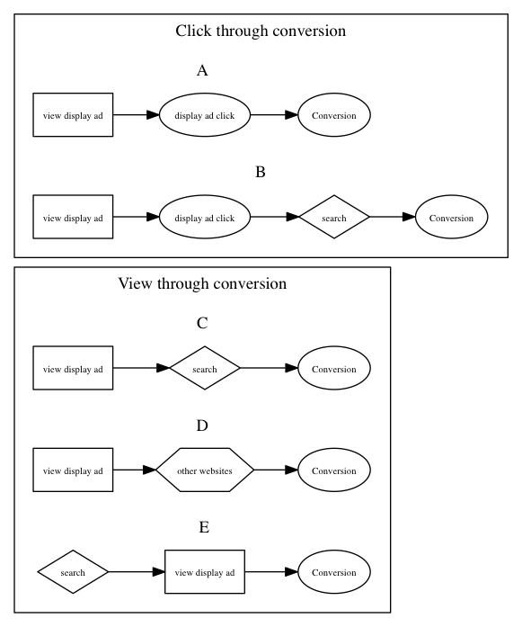

Marketing
==================

### Tools

Query Builder

- [Google Analytics Tools - Query Explorer](http://ga-dev-tools.appspot.com/explorer/)

Cochort Analysis

- [Cohort Visualizer » A handy tool for browsing cohort datasets](http://bslatkin.github.io/cohorts/)

Segmentation

- [LinkedIn's Segmentation & Targeting Platform (Hadoop Summit 2013)](http://www.slideshare.net/r39132/linkedins-segmentation-targeting-platform)

## Framework

### FRM

### AARRR

 **Acquisition:** users come to site from various **channels**

 **Activation:** users enjoy 1st visit with **happy** experience

 **Retention:** users **come back**, visit site multiple times

 **Referral:** users like product enough to **refer others**

 **Revenue:** users conduct some **monetization** behavor

| type          | KPI          |   |
| ------------- |:-------------:| -----:|
| **A**cquisition   | registered user, |  |
| **A**ctivation    |       |   |
| **R**etentionipes | continuous. rate |     |
| **R**eferral      | inflow channels, CVR |
| **R**evenue       | ARPPU |

- [Startup Metrics for Pirates (Sept 2012)](http://www.slideshare.net/dmc500hats/startup-metrics-for-pirates-sept-2012/23)

### Segmentation

- [Google Analytics Visitor Segmentation: Users, Sequences, Cohorts! - Occam's Razor by Avinash Kaushik](http://www.kaushik.net/avinash/google-analytics-visitor-segmentation-users-sequences-cohorts/)
- [Web Analytics Segments: 3 Key Category Recommendations](http://www.kaushik.net/avinash/web-analytics-segments-three-category-recommendations/)
- [Advanced Web Analytics Visitor Segments: Non-Flirts, Social, Long Tail](http://www.kaushik.net/avinash/advanced-analytics-visitor-segments-engagement-social-media-search-long-tail/)

### Attribution

*Types of conversion path*

Click through conversion users(4% users):

**A:** views an ad, clicks on the ad and reaches conversion.

**B:** views an ad, clicks on the ad, search an item for more detail and reaches conversion.

View through conversion users(95% users):

**C:** views an ad, search an item without clicking on the ad and reaches conversion.

**D:** views an ad, visit a website to survey on an item without clicking on the ad and reaches conversion.

**E:** search a publisher website, view an ad and reach conversion without clicking on the ad.

Note that most users may not remember an ad they view, even the ad does not display on the screen.

*Attribution Modeling*

divide sources of conversions path into first page, intermediate pages and last pages. 

Types of attribution Models:

1. **even distribution model:** assgins contribution evenly. 

2. **first weighted model:** assgins higher contribution to the first source. 

3. **last weighted model:** assgins higher contribution to the last source. 

4. **last click model:** assigns 100 contribution to the last click.

- [Multi-Channel Attribution: Definitions, Models and a Reality Check](http://www.kaushik.net/avinash/multi-channel-attribution-definitions-models/)
- 田中弦, アトリビューション 広告効果の考え方を根底から覆す新手法

## Visualization

### Visitor FLow

- [Path Analysis: A Good Use of Time? - Occam's Razor by Avinash Kaushik](http://www.kaushik.net/avinash/path-analysis-a-good-use-of-time/)
- [Flow Visualization - Analytics Help](https://support.google.com/analytics/topic/2472754?hl=en&ref_topic=1727148)
- [Path Analysis in Google Analytics with Flow Visualization - Analytics Talk](http://cutroni.com/blog/2011/10/19/path-analysis-in-google-analytics-with-flow-visualization/)
- [How to Use Google Analytics Visitors Flow Reports to Improve Conversion Rates - Search Engine Watch (#SEW)](http://searchenginewatch.com/article/2273391/How-to-Use-Google-Analytics-Visitors-Flow-Reports-to-Improve-Conversion-Rates)

### Funnel

- [Funnel Problems in Google Analytics](http://www.lunametrics.com/blog/2008/06/25/funnel-problems-google-analytics/#sr=d&m=n&cp=d&ct=-tmc&ts=1399376525)
- [Kimball13:Ch.8 Step Demension for Sequential Behavior][Kimball13]

-

